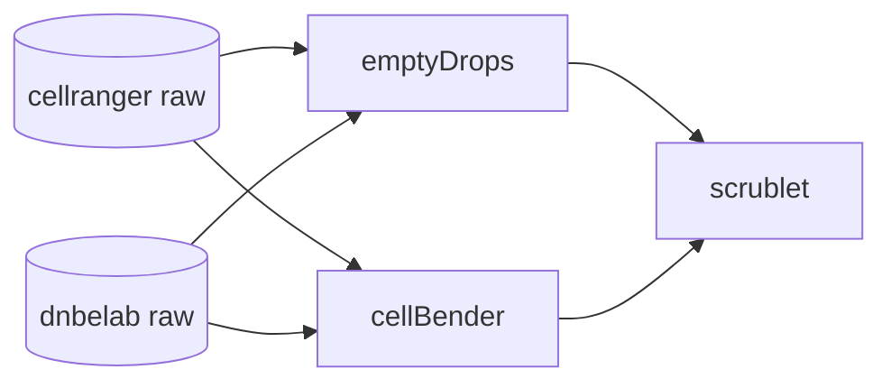

# For $/beta$ test of Dnbelab and compared with 10x V3

An overview:

## Folder structure

/upstream_stats: reports from cellranger count and dnbelab run  
/h5_input: h5 matrices from calling cell with EmptyDrops or Cellbender + cellranger count or dnbelab run  
/h5_analysis: general qc before and after scrublet

## Next step

integrate matrices from both platforms with scVI